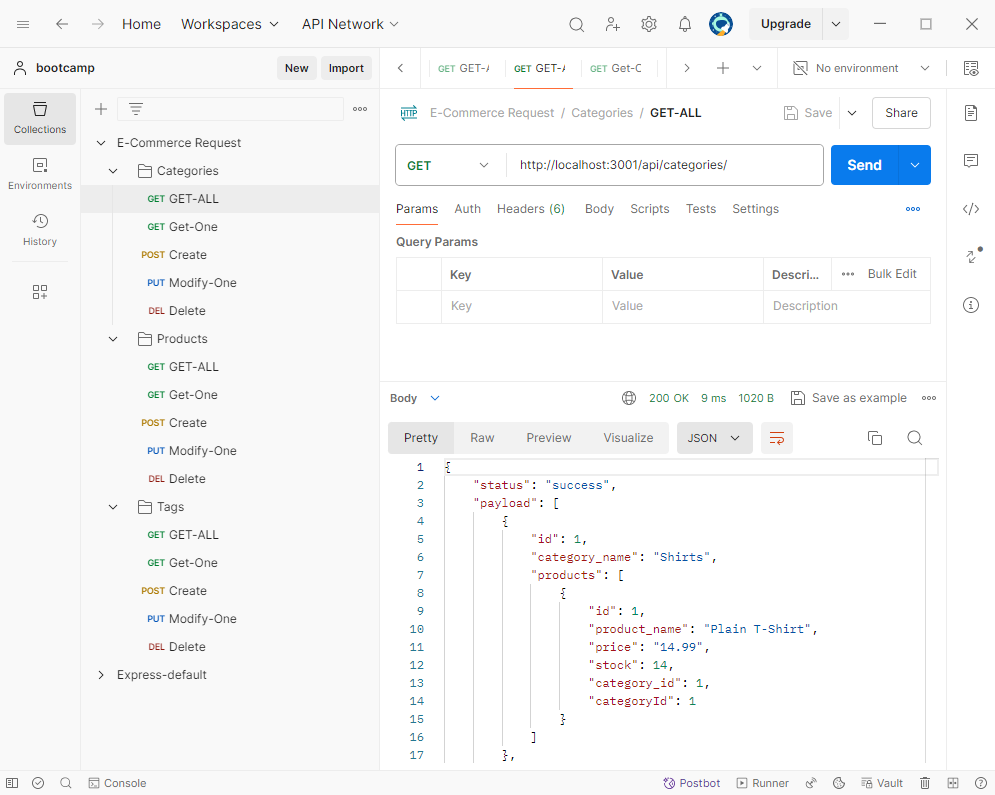
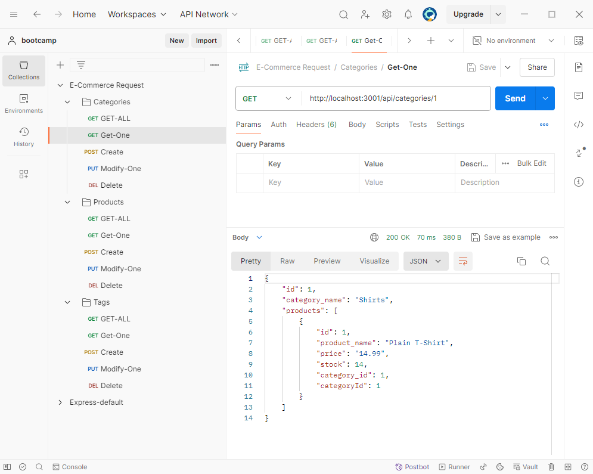
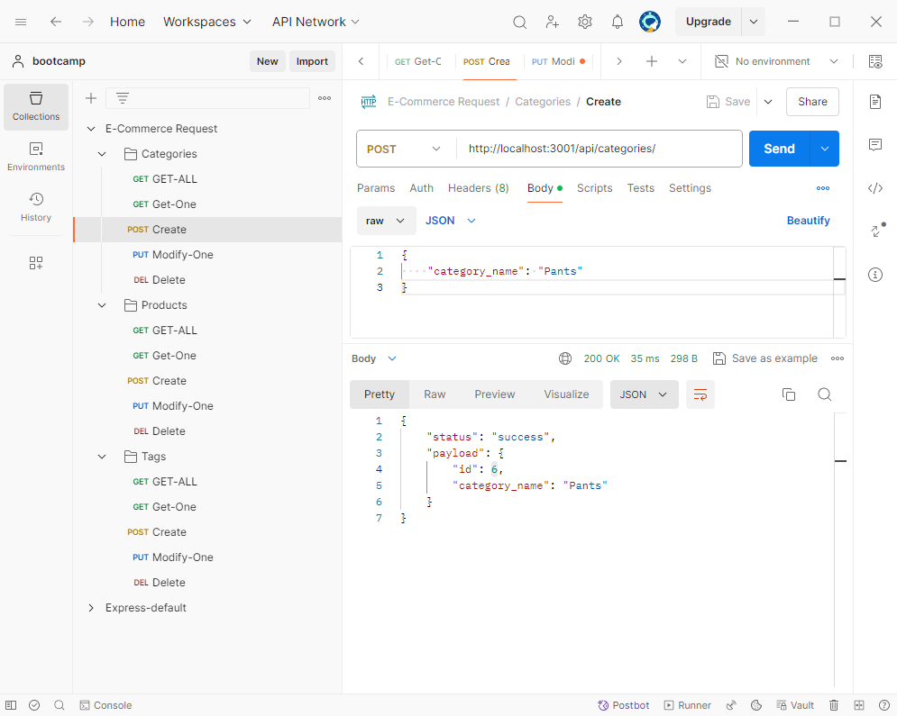
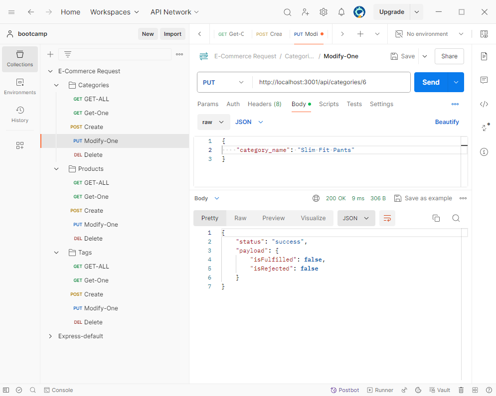
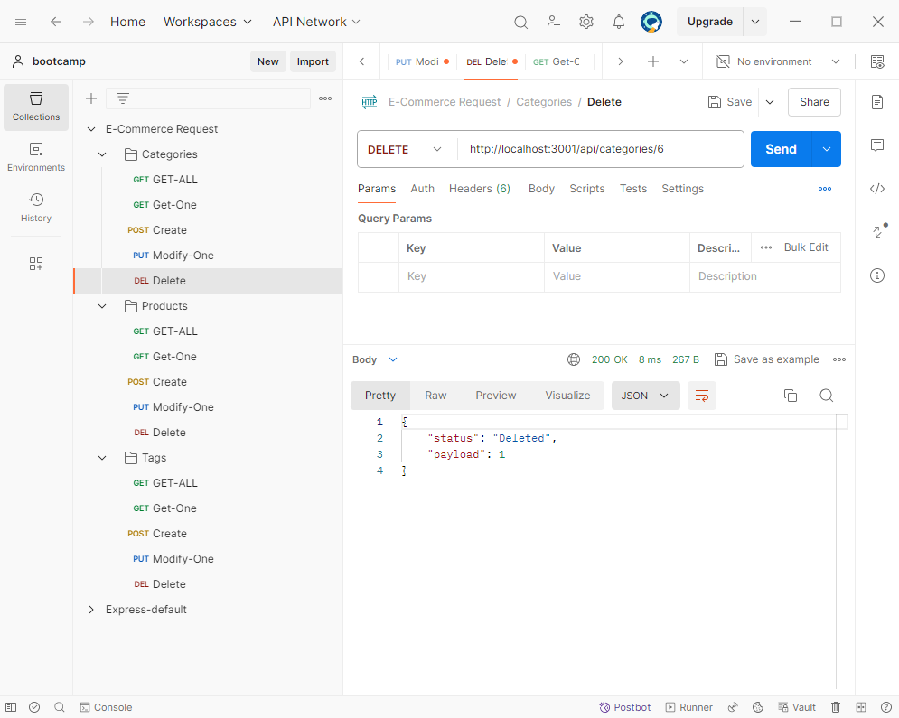

# E-commerce Backend Application

## Table of Contents
[Description](#description)
[Usage](#usage)

## Description
The E-commerce Backend application allows the user to make HTTP requests, using CRUD (Create, Read, Update, Delete), to make changes to the database.  The user can make the following calls:
- /api/categories
- /api/products
- /api/tags

Video URL: https://drive.google.com/file/d/1dkfjzZnxKG4WNaKx_C8ZpDxK04bUHIWc/view

GitHub Repo URL: https://github.com/whougie/e-commerce-backend.git

## Usage
To run the application.  The user will need to run the schema.sql in the DB folder to create the database. 
Ex. \i schema.sql

To seed the database with data.  Use Node to seed the database with data.
Ex. npm start seed

To startup the application.  Use Node to start up the application.
Ex. npm run start

Once the application is up and running.  The user can send HTTP request to the Express server using CRUD for the following routes: 
- /api/categories (GET, POST, PUT, DELETE)
- /api/products (GET, POST, PUT, DELETE)
- /api/tags (GET, POST, PUT, DELETE)

Ex. Get all categories

Ex. Get one category

Ex. Create a new category

Ex. Modify a category

Ex. Delete a category

